<!-- ABOUT THE PROJECT -->
<!-- ABOUT THE PROJECT -->
## About The Project

A timer is an essential hardware module in every digital chip and embedded system. It is primarily used to generate accurate timing intervals and to control the timing of various operations within a circuit. Timers operate by counting clock cycles and comparing the count value against predefined thresholds to trigger specific events. In modern processor-based systems, timers play a critical role in coordinating system activities, enabling time-based scheduling, and ensuring reliable system behavior. They are widely used in both hardware and software to manage delays, generate periodic signals, and synchronize different system components. 

In this project, a custom timer module is designed by adapting concepts from the CLINT (Core Local Interruptor) module of an industrial RISC-V architecture. The timer is capable of generating interrupts based on user-defined settings and is configurable through an APB (Advanced Peripheral Bus) interface. The design supports precise time measurement, interrupt control, and flexible clock division, making it suitable for embedded and SoC-based applications. 

The designed timer module can be used in a wide range of applications, including: 
* Delay generation for task scheduling and timing control 
* Pulse generation for control and signaling applications 
* Event generation based on time expiration 
* PWM (Pulse Width Modulation) generation 
* Interrupt generation to notify the CPU about time-based events 

Timers are also closely associated with interrupt mechanisms, which temporarily halt the normal execution flow of the CPU to service time-critical events. Interrupts generated by timers are typically hardware interrupts and can be configured as maskable interrupts, allowing software control over their activation. Depending on system requirements, interrupts can be implemented as level-triggered or edge-triggered signals. 

---

### Key Features

The customized timer module designed in this project supports the following features: 

* **64-bit Count-Up Timer:** The timer uses a 64-bit counter that increments continuously, allowing long timing intervals and high-resolution time measurement. 
* **APB Slave Interface:** The register set of the timer is configured through an APB bus, where the timer acts as an APB slave. This enables easy integration into standard SoC designs. 
* **12-bit Address Space:** A 12-bit address bus is used to access the timer registers, providing sufficient address space for control, status, and configuration registers. 
* **Advanced APB Support:** 
  * Supports wait states (up to 1 clock cycle) 
  * Includes error handling for invalid accesses 
  * Supports byte-level access for flexible register manipulation 
* **Clock Source Selection and Divider:** The counter can operate directly on the system clock or on a divided clock. Clock division is supported up to 256, allowing adjustable timer resolution. 
* **Interrupt Generation:** The timer can generate an interrupt when a programmed condition is met: 
  * Interrupts can be enabled or disabled by the user 
  * Used to notify the CPU of time-based events 
* **Debug Mode Support:** The timer supports a halt (stop) feature during debug mode. When the system enters debug mode, the timer can be paused to allow accurate monitoring and troubleshooting without affecting timing behavior. 
* **Active-Low Asynchronous Reset:** The timer uses an active-low asynchronous reset, ensuring the counter and control registers are reset reliably regardless of the system clock.
### Project Architecture

#### Top Module

#### CNT Control

#### Prohibit Logic
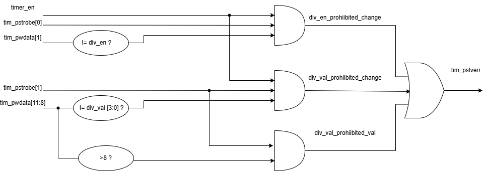

#### Register File
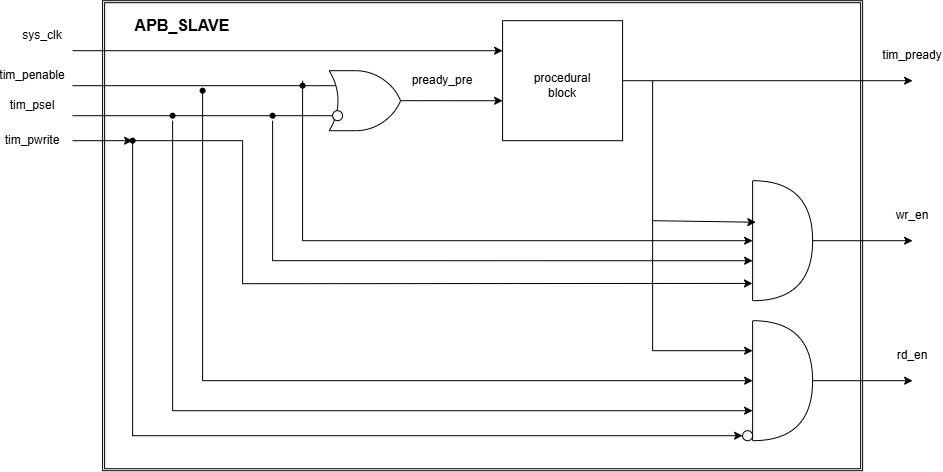

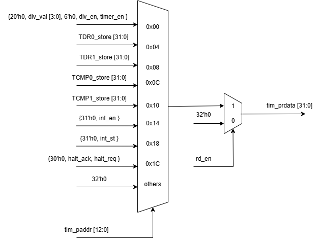

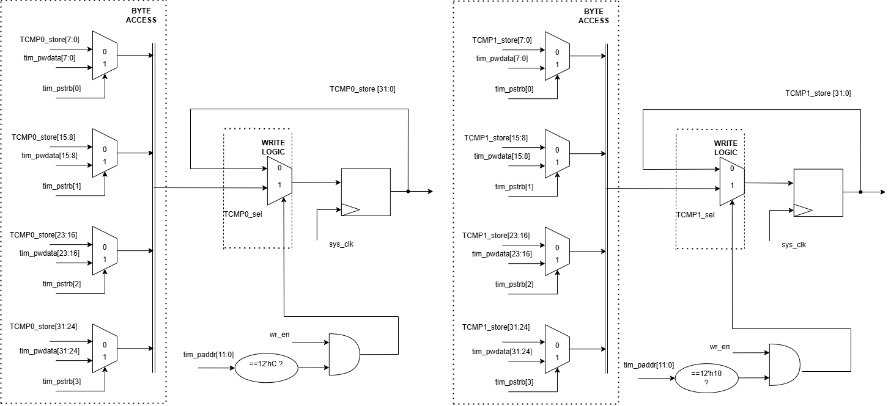

.png>)

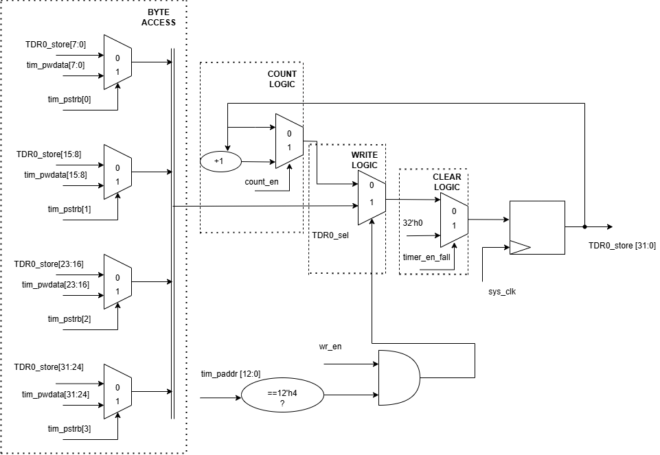

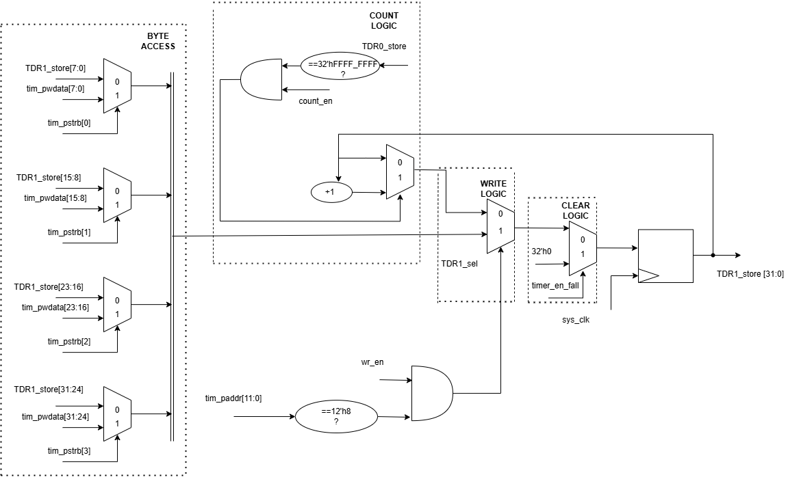

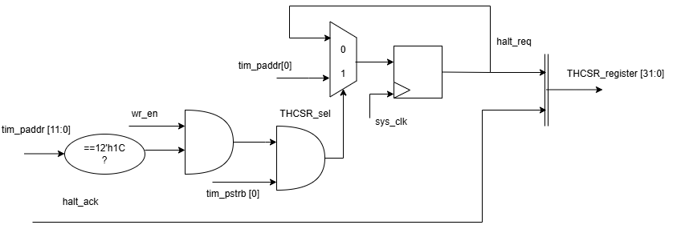

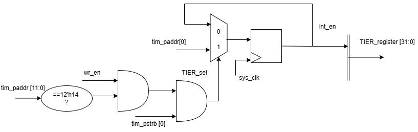

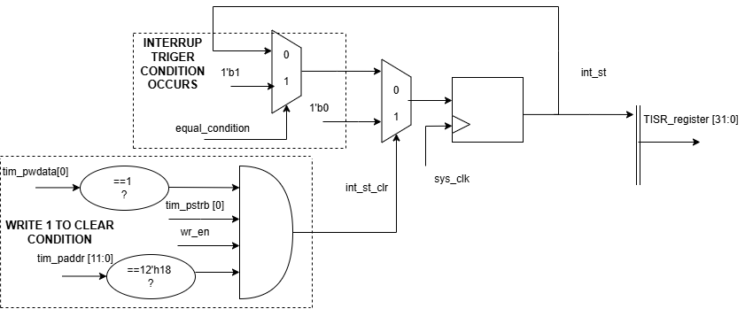

### Project Components

The **[timer_top.v](rtl/timer_top.v)** consists of several sub-blocks, each responsible for a specific function in timer operation, configuration, and interrupt generation:

* **[APB_slave.v](rtl/APB_slave.v)**: Provides the communication interface between the processor and the timer module. It receives read and write transactions from the APB bus and decodes the address, control, and data signals. This block generates internal control signals such as read enable and write enable and forwards register addresses and write data to the register block. It also returns read data and error/status responses back to the APB bus.

* **[counter_control.v](rtl/counter_control.v)**: Implements the core timing functionality of the timer. It manages the 64-bit count-up counter and controls when and how the counter increments. Based on the configuration from the register block, this block selects the clock source, applies the clock divider (up to 256), enables or disables counting, and handles halt requests during debug mode. It also detects timer events such as compare matches or timer enable transitions.

* **[timer_register.v](rtl/timer_register.v)**: Stores all programmable configuration and status registers of the timer. These registers are accessed through the APB slave interface. It holds control bits for enabling or disabling the timer, interrupt enable settings, clock divider values, debug halt control, and interrupt status flags. The register block acts as the central control point, distributing configuration signals to other sub-blocks and collecting status information from them.

* **[interrupt.v](rtl/interrupt.v)**: Is responsible for generating timer interrupts. It monitors the timer status and event signals from the counter control block and asserts an interrupt when the programmed condition is met. The interrupt generation can be enabled or disabled through control registers. The block also updates interrupt status flags and drives the final interrupt output signal to the processor.

##  Test Results & Verification

The design has been verified by comparing the simulation output of the built model against the reference golden model.

### 1. Golden Model Simulation Result
The reference report showing expected behavior and timing:

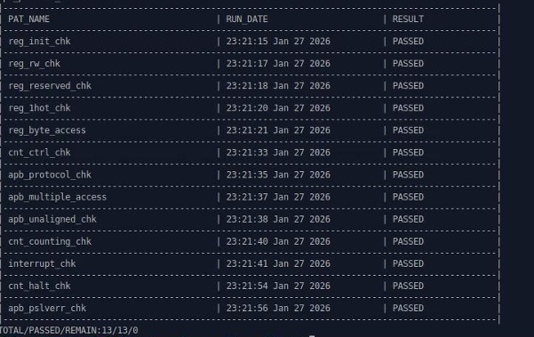

---

### 2. Built Design Simulation Result
The RTL design simulation result matching the golden reference:

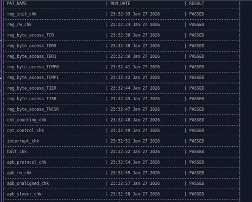
### 3. Coverage Report
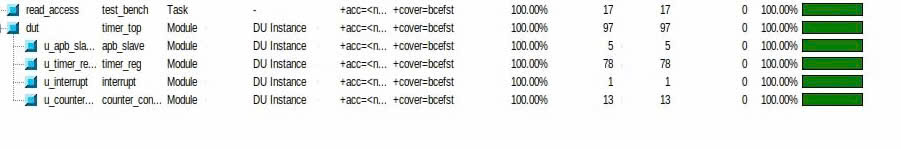